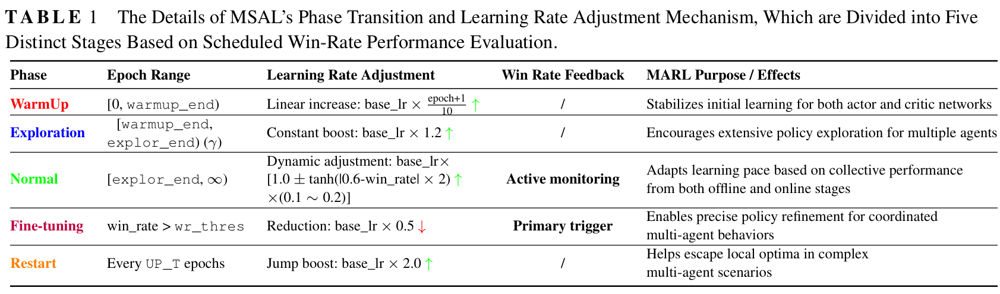

# CDCT-AO: A Novel Curiosity-Driven Convolutional Transformer with Adaptive Optimization for Offline-to-Online Multi-Agent Reinforcement Learning (StarCraft II) 🌝🌝🌝

[](https://opensource.org/licenses/MIT)
[](https://www.python.org/downloads/)
[](https://pytorch.org/)

Official implementation of our International Journal of Intelligent Systems submission:  
**"CDCT-AO: A Novel Curiosity-Driven Convolutional Transformer with Adaptive Optimization for Offline-to-Online Multi-Agent Reinforcement Learning"**

[[Paper]](https://albert-jin.github.io/) | [[Project Page]](https://github.com/albert-jin/CDCT-AO) | [[SMAC Benchmark]](https://github.com/oxwhirl/smac)

<!-- https://arxiv.org/abs/XXXX.XXXXX -->
---

## 🚀 Key Features
- **MA-CCT**: Multi-Agent Causal-convolutional Transformer integrating causal convolution filters into Transformer architecture
- **CurExp**: Novel curiosity-driven exploration mechanism using next-state prediction error
- **MSAL**: Multi-Stage Adaptive Learning-rate scheduler for robust optimization
- **State-of-the-art performance** on StarCraft II Micromanagement (SMAC) benchmark
- **Enhanced OOD Generalization**: Superior handling of out-of-distribution states through improved exploration

---
- Main Architecture of CDCT-AO
<p align="center">
  
</p>

---
- Structure of MA-CCT
<p align="center">
  
</p>

---
- Structure of CurExp, Curiosity-driven Exploration Mechanism
<p align="center">
  
</p>

---
- Details of Multi-Stage Adaptive Learning-rate scheduler (MSAL)
<p align="center">
  
</p>

---
## 🧩 Key Components
- **MA-CCT Architecture**: 
  - Replaces MHSA in Transformer with causal-convolution based token-mixer
  - Better captures localized temporal patterns in MDP sequences
  - Enhanced generalization for OOD states through improved Markov property modeling
- **CurExp Mechanism**: 
  - Utilizes forward dynamics model for next-state transition prediction
  - Uses prediction error to guide exploration towards uncertain states
  - Bridges offline-online distribution gap during fine-tuning
- **MSAL Scheduler**: 
  - Multi-stage adaptive learning rate adjustment
  - Warmup phase for stability, exploration phase for adaptation, fine-tuning phase for convergence
  - Dynamic optimization based on real-time performance feedback

---
## 📌 Installation

1. **Clone the repository**:
```bash
git clone https://github.com/albert-jin/CDCT-AO.git
cd CDCT-AO
```

2. **Install dependencies**:
```bash
pip install -r requirements.txt
bash install_sc2.sh
```

## 🏃 Quick Start

Run offline pre-training + online fine-tuning (offline-to-online) on 3s5z map:
```bash
python run_madt_sc2.py --map_name 3s5z --cuda_id 0
```

## 🏆 Performance

- Performance Comparisons of Online Fine-tuning
---
<p align="center">
  
</p>

- Offline Comparisons Between Baselines and Our CDCT-AO
---
<p align="center">
  
</p>

## 🏆🏆 Ablations

- Ablation of CurExp comparison in CDCT-AO ➡️ (Curiosity-Driven Exploration vs. Without Curiosity-Driven Exploration)
---
<p align="center">
  
</p>

- Ablation of MA-CCT in CDCT-AO ➡️ (Causal-Convolution vs. Transformer MHSA)
---
<p align="center">
  
</p>

- Ablation of MSAL in CDCT-AO ➡️ (Self-Adaptive MSAL with Other Learning Rate Schedulers)
---
<p align="center">
  
</p>

## 🛠️ Customization
Modify `./models/gpt_model.py` to:
- Adjust causal-convolution architectures 
- Experiment with different token mixing strategies 
- Tune convolution filter parameters

Modify `./models/curiosity_model.py` to:
- Implement custom curiosity mechanisms 
- Modify prediction error calculation 
- Adjust exploration bonus weights

Edit `./framework/utils.py` & `./framework/trainer.py` & `./framework/rollout.py` to:
- Customize learning rate schedules 
- Modify phase transition thresholds 
- Implement alternative adaptive strategies

---

## 🤝 Contributing
We welcome contributions! Please open an issue or submit PRs for:
- ~~New SMAC scenarios~~
- Alternative policy coordination mechanisms
- Performance optimizations

This project is forked from [ReinholdM/Offline-Pre-trained-Multi-Agent-Decision-Transformer](https://github.com/ReinholdM/Offline-Pre-trained-Multi-Agent-Decision-Transformer), many thanks to their foundational research work.

## 📜 Citation
If you use this work, please cite:
```bibtex
@article{shi2025cdctao,
  title={CDCT-AO: A Novel Curiosity-Driven Convolutional Transformer with Adaptive Optimization for Offline-to-Online Multi-Agent Reinforcement Learning},
  author={Shi, Bohang (Equal. Contributed.) and Jin, Weiqiang (Equal. Contributed.) and Zhao, Biao},
  journal={Machine Learning (under review)},
  year={2025},
}
